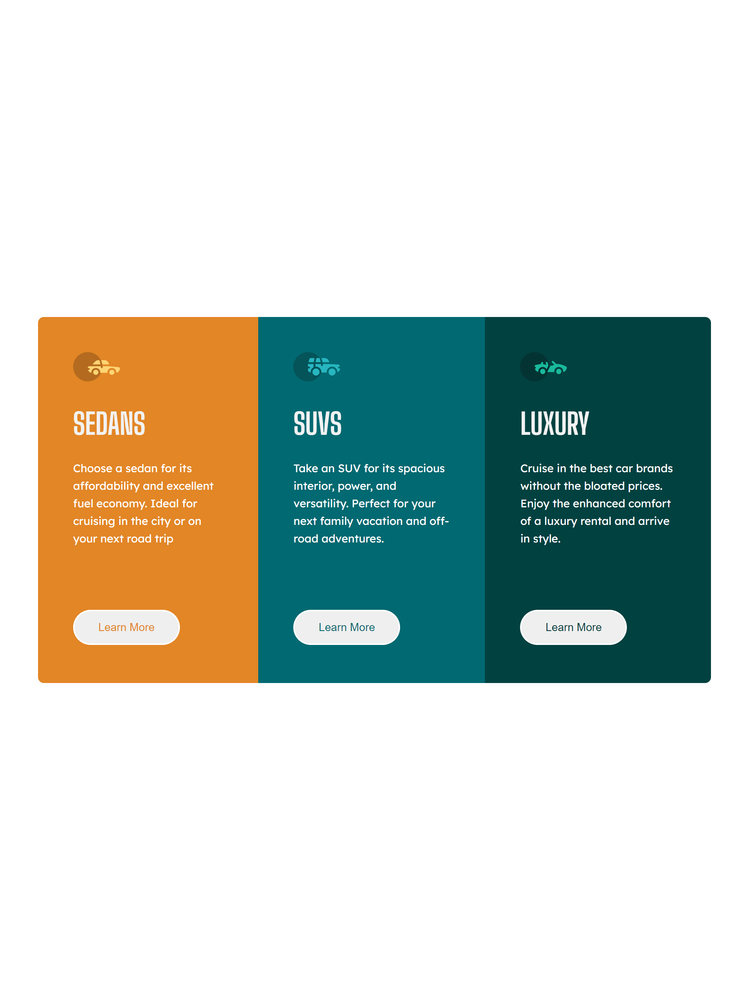

# Frontend Mentor - 3-column preview card component solution

This is a solution to the [3-column preview card component challenge on Frontend Mentor](https://www.frontendmentor.io/challenges/3column-preview-card-component-pH92eAR2-). Frontend Mentor challenges help you improve your coding skills by building realistic projects.

## Table of contents

- [Overview](#overview)
  - [The challenge](#the-challenge)
  - [Screenshot](#screenshot)
  - [Links](#links)
- [My process](#my-process)
  - [Built with](#built-with)
  - [What I learned](#what-i-learned)
  - [Continued development](#continued-development)
  - [Useful resources](#useful-resources)
- [Author](#author)

## Overview

### The challenge

Users should be able to:

- View the optimal layout depending on their device's screen size
- See hover states for interactive elements

### Screenshot

[//]: # '! renders file as picture'
[//]: # './ refers to local dir; / refers to base dir'

### Links

- Solution URL: [GitHub](https://your-solution-url.com)

## My process

### Built with

- Semantic HTML5 markup
- Vanilla CSS + BEM
- Flexbox
- Responsive Design

### What I learned

HTML

- Used semantic tags **main** and **section** for 3 cards

CSS

- targeted HTML elements for styling using content-independent ID's and Class names derived from repeating structural and functional patterns present in the design
- used **BEM** naming convention for **card** block and elements
- used single-row/column **Flexbox** for responsive desktop and mobile layout

Accessibility

- set line height to 1.5 as it is considered the minimum height for accessibility.

### Continued development

HTML

- I want to continue to develope my understanding of the proper use of **semantic HTML** in structuring document content and providing increased accessibility.

CSS

- Continue to explore the usefulness and limitations of BEM naming convention.
- Explore the use of **utility-first** CSS; specifically Tailwind.

Resources:

- [How to Use The HTML5 Sectioning Elements](https://blog.teamtreehouse.com/use-html5-sectioning-elements) - Good introduction to proper use of HTML sectioning elements.

- [CSS Utility Classes and "Separation of Concerns"](https://adamwathan.me/css-utility-classes-and-separation-of-concerns/) - Transition from "Semantic CSS" to "Content-agnostic CSS" to "Utility-first CSS"

## Author

- Frontend Mentor - [@bpettee](https://www.frontendmentor.io/profile/bpettee)
